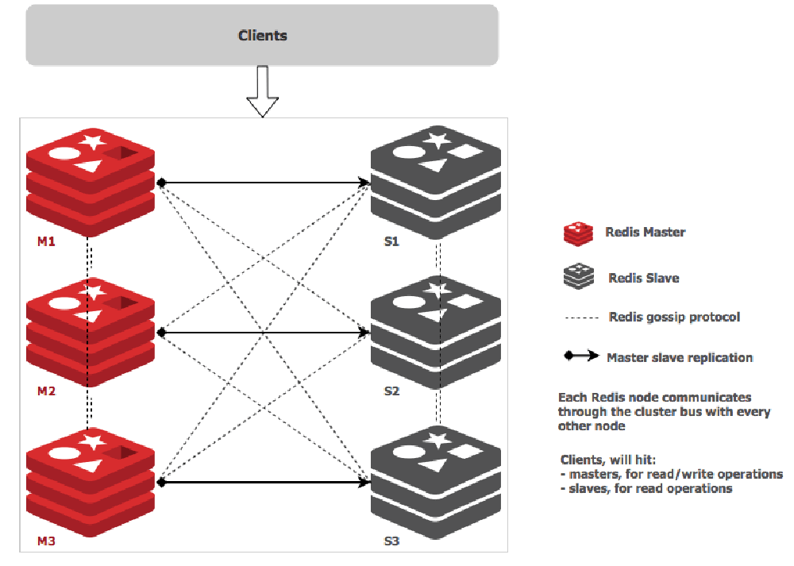
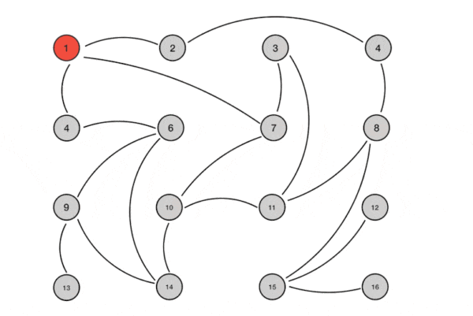

## 背景

在分布式系统中，不同的节点进行数据/信息共享是一个基本的需求。

比较简单粗暴的方法集中式发散消息，简单来说就是一个主节点同时共享最新信息给其他所有节点。但是，这种方法缺陷太多，节点多的时候不光同步消息的效率低，还太依赖与主节点，存在单点风险。

于是，分散式发散消息的 Gossip 协议就诞生了。

## Gossip 协议介绍

Gossip 直译过来就是闲话、流言蜚语的意思。流言蜚语有什么特点呢？容易被传播，你传我我传他，然后大家都知道了。

Gossip 协议也叫 Epidemic 协议（流行病协议）或者 Epidemic propagation 算法（疫情传播算法），别名很多。不过，这些名字的特点是都具有 **随机传播特性** 的特点（联想一下病毒传播、癌细胞扩散等生活中常见的情景），这也正是 Gossip 协议最主要的特点。

Gossip 协议最早是在 ACM 上的一篇 1987 年发表的论文 [《Epidemic Algorithms for Replicated Database Maintenance》](https://dl.acm.org/doi/10.1145/41840.41841)中被提出的。根据论文标题，我们大概就能知道 Gossip 协议当时提出的主要应用是在分布式数据库系统中各个副本节点同步数据。

正如其名一样，这是一种随机且带有传染性的方式将信息传播到整个网络中，并在一定时间内，使得系统内的所有节点数据一致。

下面我们来对 Gossip 协议的定义做一个总结： **Gossip 协议是一种允许在分布式系统中共享状态的通信协议，通过这种通信协议，我们可以将信息传播给网络或集群中的所有成员。**

## Gossip 协议应用

1、我们经常使用的分布式缓存 Redis 的官方集群解决方案（3.0 版本引入） Redis Cluster 就是基于 Gossip 协议来实现集群中各个节点数据的最终一致性。

Redis Cluster 中的每个 Redis 节点都维护了一份集群的状态信息，各个节点利用 Gossip 协议传递的信息就是集群的状态信息。

下图就是主从架构的 Redis Cluster 的示意图，图中的虚线代表的就是各个节点之间使用 Gossip 进行通信 ，实线表示主从复制。

2、NoSQL 数据库 Apache Cassandra 集群通过 Gossip 协议来进行动态管理集群节点状态（节点故障检测和恢复）。

3、服务网格解决方案 Consul 使用 Gossip 协议网络内可靠有效地传输新服务和事件的信息。

4、Bitcoin 使用 Gossip 协议来传播交易和区块信息。不过，为了提供更好的隐私保护，CMU 的研究人员提出 **蒲公英协议**。

5、......

还有非常多使用 Gossip 协议的应用，学习 Gossip 协议有助于我们搞清很多技术的底层原理。

## Gossip 协议消息传播模式

Gossip 设计了两种可能的消息传播模式：**反熵（Anti-Entropy）** 和 **传谣（Rumor-Mongering）**。

### 反熵(Anti-entropy)

根据维基百科：

> 熵的概念最早起源于[物理学](https://zh.wikipedia.org/wiki/物理学)，用于度量一个热力学系统的混乱程度。熵最好理解为不确定性的量度而不是确定性的量度，因为越随机的信源的熵越大。

在这里，你可以把反熵中的熵了解为节点之间数据的混乱程度/差异性，反熵就是指消除不同节点中数据的差异，提升节点间数据的相似度，从而降低熵值。

具体是如何反熵的呢？集群中的节点，每隔段时间就随机选择某个其他节点，然后通过互相交换自己的所有数据来消除两者之间的差异，实现数据的最终一致性。

在实现反熵的时候，主要有推、拉和推拉三种方式：

- 推方式，就是将自己的所有副本数据，推给对方，修复对方副本中的熵。
- 拉方式，就是拉取对方的所有副本数据，修复自己副本中的熵。
- 推拉就是同时修复自己副本和对方副本中的熵。

伪代码如下：

在我们实际应用场景中，一般不会采用随机的节点进行反熵，而是需要可以的设计一个闭环。这样的话，我们能够在一个确定的时间范围内实现各个节点数据的最终一致性，而不是基于随机的概率。像 InfluxDB 就是这样来实现反熵的。

1. 节点 A 推送数据给节点 B，节点 B 获取到节点 A 中的最新数据。
2. 节点 B 推送数据给 C，节点 C 获取到节点 A，B 中的最新数据。
3. 节点 C 推送数据给 A，节点 A 获取到节点 B，C 中的最新数据。
4. 节点 A 再推送数据给 B 形成闭环，这样节点 B 就获取到节点 C 中的最新数据。

虽然反熵很简单实用，但是，节点过多或者节点动态变化的话，反熵就不太适用了。这个时候，我们想要实现最终一致性就要靠 **谣言传播(Rumor mongering) ** 。

### 谣言传播(Rumor mongering)

谣言传播指的是分布式系统中的一个节点一旦有了新数据之后，就会变为活跃节点，活跃节点会周期性地联系其他节点向其发送新数据，直到所有的节点都存储了该新数据。

如下图所示（下图来自于[INTRODUCTION TO GOSSIP](https://managementfromscratch.wordpress.com/2016/04/01/introduction-to-gossip/) 这篇文章）：

伪代码如下：

谣言传播比较适合节点数量比较多的情况，不过，这种模式下要尽量避免传播的信息包不能太大，避免网络消耗太大。

### 总结

- 反熵（Anti-Entropy）会传播节点的所有数据，而谣言传播（Rumor-Mongering）只会传播节点新增的数据。
- 我们一般会给反熵设计一个闭环。
- 谣言传播（Rumor-Mongering）比较适合节点数量比较多或者节点动态变化的场景。

## Gossip 协议优势和缺陷

**优势：**

1、相比于其他分布式协议/算法来说，Gossip 协议理解起来非常简单。

2、能够容忍网络上节点的随意地增加或者减少，宕机或者重启，因为 Gossip 协议下这些节点都是平等的，去中心化的。新增加或者重启的节点在理想情况下最终是一定会和其他节点的状态达到一致。

3、速度相对较快。节点数量比较多的情况下，扩散速度比一个主节点向其他节点传播信息要更快（多播）。

**缺陷** :

1、消息需要通过多个传播的轮次才能传播到整个网络中，因此，必然会出现各节点状态不一致的情况。毕竟，Gossip 协议强调的是最终一致，至于达到各个节点的状态一致需要多长时间，谁也无从得知。

2、由于拜占庭将军问题，不允许存在恶意节点。

3、可能会出现消息冗余的问题。由于消息传播的随机性，同一个节点可能会重复收到相同的消息。

## 总结

- Gossip 协议是一种允许在分布式系统中共享状态的通信协议，通过这种通信协议，我们可以将信息传播给网络或集群中的所有成员。
- Gossip 协议被 Redis 、Apache Cassandra、Consul 等项目应用。
- 谣言传播（Rumor-Mongering）比较适合节点数量比较多或者节点动态变化的场景。

## 参考

- 一万字详解 Redis Cluster Gossip 协议：https://segmentfault.com/a/1190000038373546
- 《分布式协议与算法实战》
- 《Redis 设计与实现》